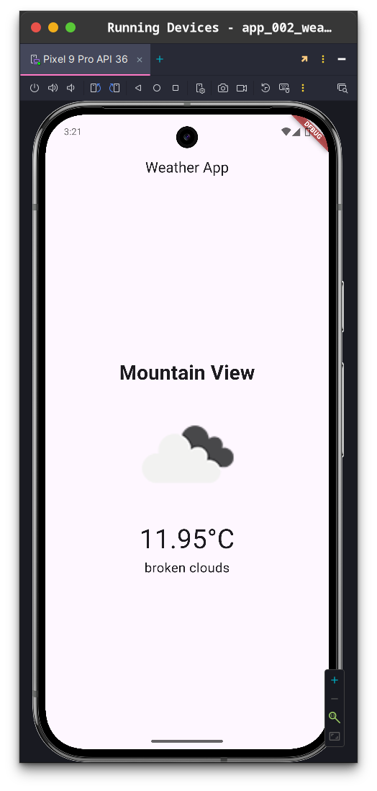
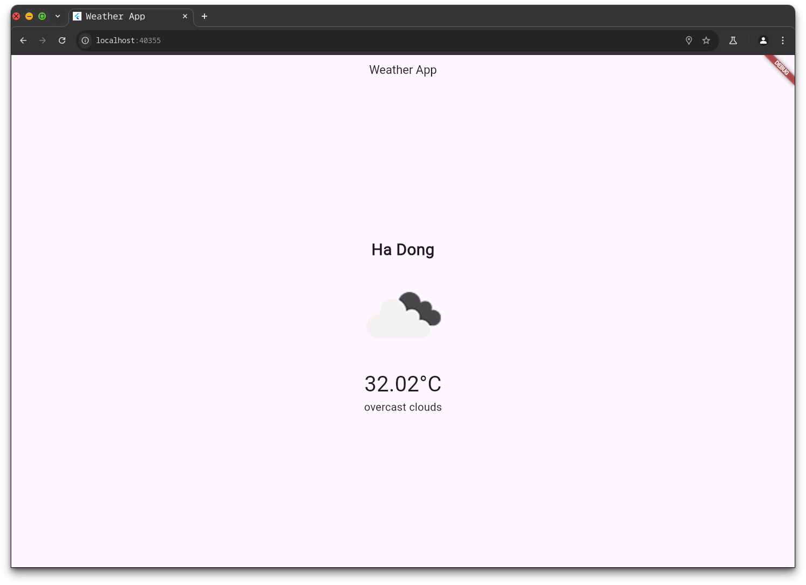

# Weather App

A simple weather application built with **Flutter** using the **OpenWeather API** to display real-time weather information based on the user's location.

## Features
- Displays current weather information including city name, temperature, weather description, and icon.
- Fetches the user's location using the `geolocator` package.
- Handles location permissions gracefully with the `permission_handler` package.
- Simple and clean UI with loading state and error handling.

## Screenshots
### Main Screen
 

### Structure File


## Prerequisites
- **Flutter SDK**: Ensure you have Flutter installed. [Install Flutter](https://flutter.dev/docs/get-started/install)
- **OpenWeather API Key**: Sign up at [OpenWeatherMap](https://openweathermap.org/) to get your API key.
- **Android/iOS Emulator or Physical Device**: For testing the app.

## Installation
1. **Clone the repository**:
   ```bash
   git clone <your-repository-url>
   cd weather_app
   ```

2. **Install dependencies**:
   ```bash
   flutter pub get
   ```

3. **Set up the OpenWeather API Key**:
   - Create a file named `.env` in the root directory.
   - Add your API key:
     ```env
     OPENWEATHER_API_KEY=your_api_key_here
     ```
   - Use a package like `flutter_dotenv` to load the API key in your app.

4. **Run the app**:
   ```bash
   flutter run
   ```

## Configuration
- Ensure location permissions are enabled on the device/emulator.
- The app uses the `http` package to make API calls to OpenWeatherMap. Make sure your app has internet permissions configured in `android/app/src/main/AndroidManifest.xml` for Android and `ios/Runner/Info.plist` for iOS.

## Project Structure
```
weather_app/
├── lib/
│   ├── main.dart                # Entry point of the app
│   ├── models/                 # Data models (e.g., Weather model)
│   ├── services/               # API and location services
│   ├── screens/                # UI screens (e.g., WeatherScreen)
│   └── widgets/                # Reusable UI components
├── assets/                     # Images, fonts, and other assets
├── img/                        # Screenshots for README
├── .env                        # Environment file for API keys
└── pubspec.yaml                # Project dependencies
```

## Dependencies
The app uses the following key packages:
- `geolocator`: For accessing the device's location.
- `permission_handler`: For managing location permissions.
- `http`: For making API requests to OpenWeatherMap.
- `flutter_dotenv`: For loading environment variables.
- `provider` (optional): For state management, if implemented.

Check `pubspec.yaml` for the full list of dependencies.

## Usage
1. Launch the app on your device or emulator.
2. Grant location permissions when prompted.
3. The app will fetch and display the current weather for your location.
4. If an error occurs (e.g., no internet or invalid API key), an error message will be displayed.

## Contributing
Contributions are welcome! To contribute:
1. Fork the repository.
2. Create a new branch (`git checkout -b feature/your-feature`).
3. Make your changes and commit (`git commit -m 'Add your feature'`).
4. Push to the branch (`git push origin feature/your-feature`).
5. Open a pull request.

## License
This project is licensed under the MIT License. See the [LICENSE](LICENSE) file for details.

## Acknowledgments
- [OpenWeatherMap](https://openweathermap.org/) for providing the weather API.
- [Flutter](https://flutter.dev/) for the awesome framework.
- Inspired by various open-source Flutter projects.

---
